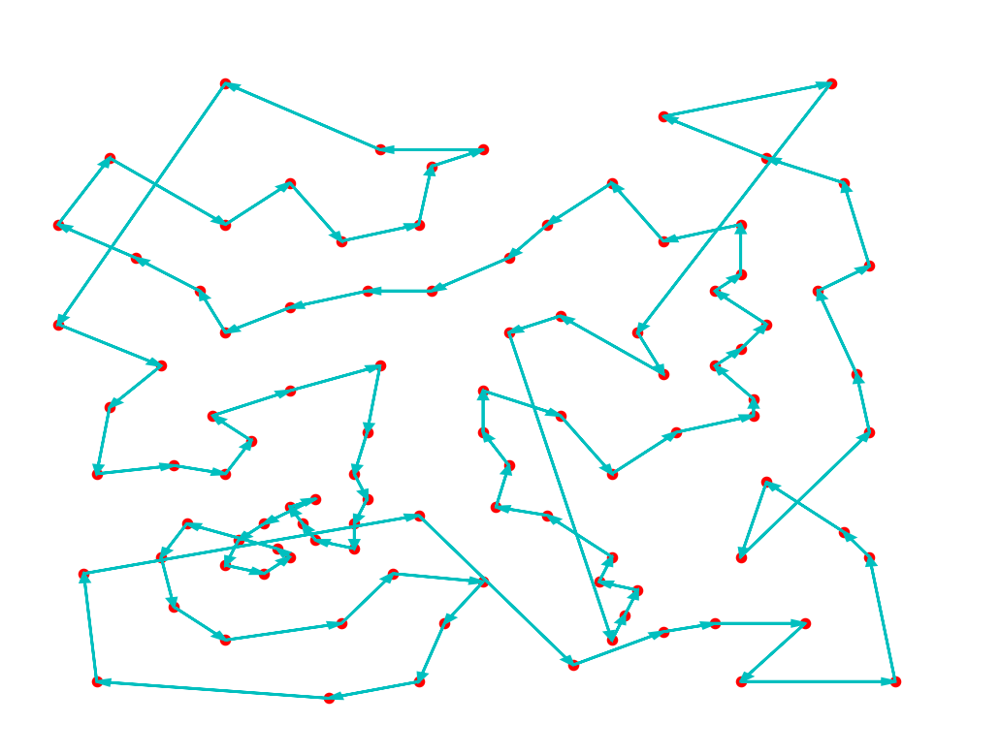

 # Travelling Salesman Problem (Nearest Neighbor) 
 
 ### Problem Statement
 
 The Travelling Salesman Problem (also called the TSP) asks the following question: *"Given a list of cities and the distances between each pair of cities, what is the shortest possible route that visits each city exactly once and returns to the origin city?"* It is an NP-hard problem in combinatorial optimization, important in theoretical computer science and operations research.

 ### Solution
 
 Numerous algorithms have been proposed to tackle the TSP, ranging greatly in computational time and solution accuracy. The slowest approach (i.e. the brute-force algorithm) runs in O(n!) time while guaranteeing an optimal solution.

 Algorithm below is an implementation of the "Nearest Neighbor" heuristic and runs in O(n^2) time. Overview of the heuristic:

 	1. Start the tour at a randomly-selected city.

	2. Repeatedly visit the closest city that the tour hasn't visited yet. In case of a tie, go to the closest city with the lowest index.

	3. Once every city has been visited exactly once, return to the first city to complete the tour.

 The implementation is extended to support multiple iterations, each with randomly-selected starting point. It also includes a visualization function for the shortest path.

 Even with multiple passes, however, the heuristic results in a suboptimal solution. Nonetheless, the implementation leads to a fairly good approximation of the optimal route, especially given the running time of the algorithm.

 ### Sample Solution

 The plot below illustrates the computed shortest path following 25 passes of the algorithm on a 101-city dataset. It is evident that the solution is unfortunately suboptimal. 

 
 
 ### Note on Sample Data
 
 The implementation can take input graphs in form of Eucledian distances. Test cases in this repository are presented in the Eucledian distances format.
 As such, the first line indicates the number of cities. Each city is a point in the plane, and each subsequent line indicates the x- and y-coordinates of a single city.  
 The distance between two cities is defined as the Euclidean distance - that is, two cities at locations *(x,y)* and *(z,w)* have distance \sqrt{(x-z)^2 + (y-w)^2} between them.   
